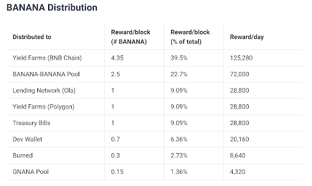

# Preparing for the BANANA Hard Cap

## Evaluating Changes to BANANA Burn

ApeSwap is excited to welcome in a new direction for the protocol after our community passed [Governance Proposal 22](https://vote.apeswap.finance/#/proposal/0x7c816da506f35d6932cf759faf81b221d566942d9472111fb795ab63150760a9) to enact a hard cap of 420,000,000 on the BANANA token. Part of the process of enacting that hard cap involves re-evaluating the existing burn mechanics built around the BANANA token, and how (or if) they fit into the future sustainability of the protocol.

Work is still in progress on the **MasterApeV2** smart contract that will implement the 420M hard cap and allow us to have more precise control over the BANANA emission schedule, but in the meantime, ApeSwap is enacting a few changes to the burn process and the rewards built in to the ApeSwap Lending Network.

## BANANA Hard Cap Tokenomics Implications

The BANANA hard cap decision, passed by governance, has important implications on how we need to approach the tokenomics of BANANA. Before the hard cap decision, BANANA had an infinite supply, which meant that it was important for the ApeSwap team to balance this with as many burn mechanics as possible with the goal of trying to get to a **deflationary circulating supply**. 

## BANANA Burn Mechanics Win

Since the inception of ApeSwap, we have been heavily focused on building BANANA burn mechanics into the platform. The biggest helper being the 28% BANANA burn when buying Golden baNANA which is a unique token implementation built internally by ApeSwap to assist with the inflationary mechanics of BANANA. 

With Golden baNANA and other burn mechanisms, the protocol is currently burning up to 5x the amount that we burn from the DEV wallet. This is validation that the core team has built solid automated burn mechanics which frees up this BANANA to be used in more strategic ways to benefit the sustainability of the protocol.

Now that BANANA has a hard cap, it’s inevitable that BANANA will be deflationary from these mechanics.

### Recent BANANA Burn History

The recent burn history shows that the protocol burns are crushing it! 

* [9/15](https://twitter.com/ape_swap/status/1570533040455041025): 300,000 Protocol Burn vs 60,000 Manual Burn 
* [9/8](https://twitter.com/ape_swap/status/1567800043687624705): 347,000 Protocol Burn vs 60,000 Manual Burn
* [9/1](https://twitter.com/ape_swap/status/1565217891120816128): 238,000 Protocol Burn vs 60,000 Manual Burn
* [8/25](https://twitter.com/ape_swap/status/1562726478508240896): 241,000 Protocol Burn vs 60,000 Manual Burn

## DEV BANANA Burn

Currently, the DEV wallet, an ApeSwap DAO controlled multi-sig wallet, receives 1 BANANA/block. The breakdown of funding can be found in the [ApeSwap Docs](https://apeswap.gitbook.io/apeswap-finance/welcome/apeswap-tokens/banana/banana-tokenomics#banana-distribution). 

As laid out in the burn history above, the protocol is currently burning up to **13.65% **of BANANA emissions, while the DEV burn is only **2.73%**. While the DEV burn rate is relatively low, it does provide beneficial opportunities for sustainability of ApeSwap . 

## Why this is good for BANANA holders 

The ApeSwap DAO currently does not hold a relatively large percentage of the BANANA tokens. This is great from a decentralization stand point, but the core team is lacking flexibility for things such as centralized exchange market making, cross chain liquidity and GNANA governance voting power. 

We believe that we have provided the value through automated BANANA burn mechanics to unlock this BANANA for interesting use cases now that the BANANA token has a hard cap and burning is not the highest priority anymore. 

## Possible Governance Proposal: BANANA Burn Choices
These are the proposed choices for a governance proposal, but definitely worth discussing in this thread.

* Do not change DEV burn allocation
* Stop burning 30% of DEV allocation to be used for protocol opportunities that do not involve selling the BANANA. Including, but not limited to: 
    * centralized exchange market making
    * providing liquidity for BANANA
    * core team GNANA allocation for voting on the direction of the protocol (would need a governance prop to define this) 