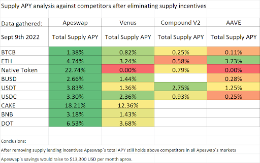
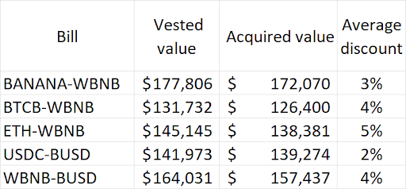

# Preparing for the BANANA Hard Cap

## Coming Changes to Lending Rewards

ApeSwap is excited to welcome a new direction for the protocol after our community passed [Governance Proposal 22](https://vote.apeswap.finance/#/proposal/0x7c816da506f35d6932cf759faf81b221d566942d9472111fb795ab63150760a9) to enact a hard cap of 420,000,000 on the BANANA token. Part of the process of enacting that hard cap involves re-evaluating the reward programs built around the BANANA token, and how (or if) those features fit into the future sustainability of the protocol.

Work is still in progress on the **MasterApeV2** smart contract that will implement the 420M hard cap and allow us to have more precise control over the BANANA emission schedule, but in the meantime, ApeSwap is enacting a few changes to the burn process and the rewards built in to the ApeSwap Lending Network.

 

## Return on Emissions

To have a proper discussion around this topic, it is vital that we consider the **return on emissions (ROE)** of the [BANANA token](https://bscscan.com/token/0x603c7f932ED1fc6575303D8Fb018fDCBb0f39a95). 

ApeSwap started as a yield farming protocol which centers on the idea that a token is emitted to incentivize liquidity to be added to the protocol. This in turn leads to fee generation to sustain the protocol. 

Because BANANA tokens are being put into circulation, it’s important to consider how much return ApeSwap receives based on the value of BANANA emitted. 

 

### What Constitutes Return?

The **return** received from BANANA emissions is the **net** return on the BANANA emitted, but the ApeSwap protocol uses this return in different ways.

**Return** consists of:
* **ApeSwap Revenue**: These are the only funds which the ApeSwap DAO can use to pay for operations.
    * 30-40% of **DEX return** is used to fund ApeSwap
    * 10% of **Lending return** is used to fund ApeSwap
    * 0% of **Treasury Bills return** is used to fund ApeSwap
    * 0% of **IAO return** is used to fund ApeSwap
* **BANANA burns**
    * 50% of **DEX return** has been used to buy BANANA and burn it up to this point
    * 27% of **Lending return** is used to buy BANANA and burn it
    * 0% of **Treasury Bills return** is used to burn BANANA
    * 100% of **IAO return** is used to burn BANANA
* **Locked Liquidity**
    * 0% of **DEX return** is locked as **[protocol owned liquidity (POL).](https://apeswap.finance/protocol-dashboard)**
    * 49.5% of **Lending return** is used to buy BANANA and lock into the BANANA supply market
    * 100% of **Treasury Bills** **return** is locked as **[protocol owned liquidity (POL).](https://apeswap.finance/protocol-dashboard)**
    * 0% of **IAO return** is used to lock liquidity

 

### Comparing ROE

The chart below lays out the **ROE** for the main protocol features which emit BANANA to users.  \

<table>
  <tr>
   <td><strong>Feature</strong>
   </td>
   <td><strong>Emissions/Percentage</strong>
   </td>
   <td><strong>Return on Emissions</strong>
   </td>
  </tr>
  <tr>
   <td>BNB Chain DEX (.005% Swap Fee)
   </td>
   <td>2.2 BANANA / 20%
   </td>
   <td>11%
   </td>
  </tr>
  <tr>
   <td>Polygon DEX (.015% Swap Fee)
   </td>
   <td>1 BANANA / 9%
   </td>
   <td>30%
   </td>
  </tr>
  <tr>
   <td><a href="https://apeswap.gitbook.io/apeswap-finance/product-and-features/lend/banana-incentives">Decentralized Lending</a>
   </td>
   <td>1 BANANA / 9%
   </td>
   <td>18%
   </td>
  </tr>
  <tr>
   <td>Treasury Bills
   </td>
   <td>1 BANANA / 9%
   </td>
   <td>95%-98%
   </td>
  </tr>
  <tr>
   <td>BANANA Pool
   </td>
   <td>2.5 BANANA / 22%
   </td>
   <td>0% 
   </td>
  </tr>
  <tr>
   <td>GNANA Pool
   </td>
   <td>.155 BANANA / 1.5%
   </td>
   <td>0%
   </td>
  </tr>
  <tr>
   <td>Gauntlet Excess Farm
   </td>
   <td>2.3 BANANA / 20%
   </td>
   <td><strong>TBD</strong>
   </td>
  </tr>
  <tr>
   <td>DEV Wallet
   </td>
   <td>1 BANANA / 9%
   </td>
   <td>95%
   </td>
  </tr>
</table>

 

Providing a testament to the improvement of **return on emissions**, ApeSwap has achieved a 96% **ROE** on Treasury Bills, vs the initial BNB Chain DEX **ROE** of 11%. This means that ApeSwap would need to emit 8.72 BNB Chain DEX BANANA for every 1 Treasury Bills BANANA to bring in the same return for these two features.

_BSC DEX vs Treasury Bills equal revenue generation_

<table>
  <tr>
   <td><strong>Feature</strong>
   </td>
   <td><strong>ROE</strong>
   </td>
   <td><strong>BANANA/block</strong>
   </td>
   <td><strong>Investment/block</strong>
   </td>
   <td><strong>Revenue/block</strong>
   </td>
  </tr>
  <tr>
   <td><strong>BNB Chain</strong>
   </td>
   <td>11%
   </td>
   <td>8.72
   </td>
   <td>$0.87
   </td>
   <td>$0.096
   </td>
  </tr>
  <tr>
   <td><strong>Treasury Bills</strong>
   </td>
   <td>96%
   </td>
   <td>1
   </td>
   <td>$0.10
   </td>
   <td>$0.096
   </td>
  </tr>
</table>

Understanding **ROE** is an important part of making wise BANANA emissions decisions for the sustainability of ApeSwap.

 

## Lending Rewards

### Lending Rewards: What’s Being Optimized

As part of our review of the protocol in response to the hard cap implementation, ApeSwap has identified an opportunity to make changes to the [ApeSwap Lending Network](https://lending.apeswap.finance/) that are in the best interest of the protocol. ApeSwap’s work with our partner Gauntlet around the Excess BANANA Farm has helped us understand that careful planning in regards to BANANA emissions benefits holders of the token and the protocol as a whole.

Specifically, given our goal to protect the long-term value of the BANANA token, ApeSwap is proposing removing **supply side BANANA rewards** from the ApeSwap Lending Network, effective two weeks after the passing of a proposal. (The **borrow side BANANA rewards** would remain unaffected by this proposal) A key factor in making this decision is that our Supply interest (i.e. interest paid in the same denomination of the token being supplied by users), is competitive with those available through market leaders such as Aave, Compound, and Venus.

We believe that this reduction in BANANA rewards on the ApeSwap Lending Network will not negatively affect the liquidity on the network while saving BANANA for higher **return on emissions** (ROE) opportunities - ensuring that we can maintain competitive returns offered by other rewards-based products including Yield Farms, Maximizers, and Treasury Bills.

 

### Lending Rewards: Future Emissions

As ApeSwap is preparing an emissions reduction schedule in relation to the BANANA hard cap, this is a great opportunity to add the **0.147 BANANA/block** currently going to the lending supply markets to the Excess BANANA Farm as proposed in [Gauntlet Emissions Budget Optimization](https://vote.apeswap.finance/#/proposal/0x593856f27c8a39afbdbf6e3d1d76577415023279753dc6b1ef9c72690e6929c3). 

This would be an amendment to the initial [Lending Network Governance Proposal](https://vote.apeswap.finance/#/proposal/0x6a0f98bb9ba4c45a1b887a13a16dd9633b1043211384fcb80107967e6e56bd5b) which allocated 1 BANANA/block. If this proposal passes, we would essentially be sending 0.853 BANANA/block to the lending network and the excess BANANA would be saved for the future emissions plan which aligns with the BANANA hard cap.

 

### Lending Rewards: Why this is good for BANANA holders 

As the BANANA token up to this point has been an inflationary token used mainly to incentivize liquidity on the platform, ApeSwap has been performing analytics on the performance of BANANA emissions. We are looking for ways to obtain the highest **return on emissions** (ROE) possible which means that BANANA is being used in the most efficient way for the protocol and all BANANA/GNANA holders. 

The chart below shows how the ApeSwap Lending Network supply APYs compare to three of the main decentralized lending networks in the DeFi space. Even after removing the BANANA supply rewards, the supply APY is still higher. 

The other part to consider about this is the high inelasticity of lending network liquidity. This means that liquidity will typically stick around longer with fluctuations in APY. 

This would allow ApeSwap to save $13,300 in BANANA emissions per month at current prices without affecting TVL, which would also have the affect of increasing the ROE on the lending borrow BANANA rewards currently being used.

 

### Lending Rewards: Why not add these rewards to the borrow side?

There are two big reasons why we are suggesting that we add these rewards to the Gauntlet Excess Farm instead of redirecting to the borrow side: 
1. BANANA hard cap is leading to emissions per block reductions and this is a great way to scale back lending rewards without affecting TVL
2. ROE on lending rewards is about 18%, while Treasury Bills is generally around 96% ROE. This means we have much better places to use the BANANA than use them for lending borrow incentives. 

## Notes

### Treasury Bills Return (ROE = 100% - Average Discount)

 

## Proposed Lending Emissions Choices

* Do not reduce lending emissions
* Reduce lending emissions by **0.147 BANANA/Block** (Supply side distribution) and add those to the Excess BANANA Farm as apart of the future hard cap + emissions reduction proposals
* Provide your own suggestion in the thread!

